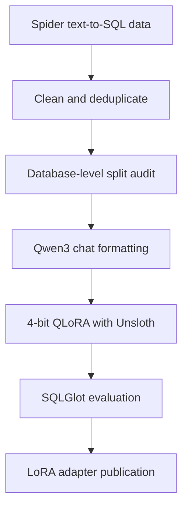

# Qwen3-4B Text-to-SQL Fine-Tuning with Unsloth

[](https://huggingface.co/shoron07/qwen3-4b-spider-unsloth)
[](https://github.com/unslothai/unsloth)
[](#training-configuration)
[](https://www.python.org/)

A compact, leakage-aware text-to-SQL fine-tuning project built in a Kaggle notebook. Qwen3-4B was adapted with Unsloth-accelerated 4-bit QLoRA on a single Tesla T4, improving strict normalized exact match on unseen database schemas.

## Results

| Metric | Untouched base | Fine-tuned | Change |
|---|---:|---:|---:|
| SQLGlot-normalized exact match | 22.63% | **39.46%** | **+16.83 points** |
| SQL syntax validity | 99.61% | **100.00%** | +0.39 points |
| SQL-only format compliance | 99.71% | **100.00%** | +0.29 points |

The exact-match score increased by **74.4% relative** over the untouched base model. Evaluation used all **1,034 validation examples**, with no database IDs shared between the training and validation splits.

> Normalized exact match is a strict structural metric, not execution accuracy. Semantically equivalent queries can be counted as different because of aliases, quotation styles, or alternative SQL structures.

## Project Highlights

- Fine-tuned `unsloth/Qwen3-4B-unsloth-bnb-4bit` for schema-aware SQLite generation.
- Used **4-bit QLoRA** with only **33,030,144 trainable parameters**, approximately **0.81%** of the architecture.
- Enforced database-level train-validation separation to prevent schema leakage.
- Trained only on assistant SQL responses by masking system and user prompt tokens.
- Completed 100 training steps in **18.15 minutes** on one **Tesla T4**.
- Used **4.77 GB peak GPU memory** during training.
- Evaluated both the untouched base model and trained adapter with identical generation settings.
- Diagnosed and resolved a multi-GPU `cuda:0`/`cuda:1` tensor-placement conflict in Kaggle.

## Workflow



## Dataset Preparation

The project uses [`hujudev/spider-text-2-sql`](https://huggingface.co/datasets/hujudev/spider-text-2-sql), a schema-enriched version of the Spider text-to-SQL dataset.

| Stage | Training | Validation |
|---|---:|---:|
| Original rows | 8,659 | 1,034 |
| Exact duplicates removed | 8 | 0 |
| Rows after deduplication | 8,651 | 1,034 |
| Rows exceeding 2,048 tokens | 96 | 0 |
| Final examples | **8,555** | **1,034** |
| Unique databases before filtering | 146 | 20 |

Preparation included:

- Missing-value validation
- Exact-duplicate removal
- Removal of redundant `Question:` and `Schema:` prefixes
- System, user, and assistant message construction
- Qwen3 chat-template application with thinking disabled
- Token-length auditing before training
- Removal of overlength examples instead of truncating schemas or SQL targets
- Verification of zero database overlap between train and validation

## Model and Adapter

| Component | Configuration |
|---|---|
| Base checkpoint | `unsloth/Qwen3-4B-unsloth-bnb-4bit` |
| Quantization | 4-bit |
| LoRA rank | 16 |
| LoRA alpha | 32 |
| LoRA dropout | 0 |
| Trainable parameters | 33,030,144 |
| Trainable percentage | 0.81% |
| Maximum sequence length | 2,048 |
| Target modules | `q_proj`, `k_proj`, `v_proj`, `o_proj`, `gate_proj`, `up_proj`, `down_proj` |
| Gradient checkpointing | Unsloth |

The base model was explicitly frozen before the adapters were attached. Verification confirmed that no unexpected non-LoRA parameters were trainable.

## Training Configuration

| Setting | Value |
|---|---|
| Framework | Unsloth + TRL `SFTTrainer` |
| Method | 4-bit QLoRA |
| Training objective | Response-only supervised fine-tuning |
| Training examples | 8,555 |
| Steps | 100 |
| Batch size per device | 2 |
| Gradient accumulation | 4 |
| Effective batch size | 8 |
| Approximate sequences processed | 800 |
| Learning rate | 2e-4 |
| Optimizer | AdamW 8-bit |
| Scheduler | Linear |
| Warmup steps | 5 |
| Precision | FP16 |
| Training time | 18.15 minutes |
| Peak training GPU memory | 4.77 GB |
| Average training loss | 0.4003 |
| Final logged loss | 0.2081 |

This was deliberately scoped as a 100-step portfolio experiment and did not complete a full epoch.

## Evaluation

Both models were evaluated on the same 1,034 held-out examples using:

- Greedy decoding
- Maximum 256 generated tokens
- SQLGlot SQLite parsing
- SQL syntax validity
- SQL-only response compliance
- SQLGlot-normalized exact match

| Runtime statistic | Base | Fine-tuned |
|---|---:|---:|
| Evaluation time | 28.86 min | 29.31 min |
| Peak GPU memory | 6.36 GB | 6.46 GB |
| Average generated tokens | 30.28 | 29.99 |

### Error-analysis examples

Some strict exact-match failures were likely semantically equivalent, such as using double rather than single quotation marks. Other failures revealed genuine risks, including unnecessary joins or alternative minimum-value queries that behave differently when ties exist.

## Repository Structure

```text
.
|-- qwen3_4b_text_to_sql_unsloth.ipynb
|-- metrics/
|   |-- base_vs_finetuned_comparison.csv
|   |-- finetuned_evaluation_summary.json
|   |-- training_history.csv
|   `-- training_summary.json
|-- project_summary.json
`-- README.md
```

The adapter weights are hosted separately on Hugging Face to keep this repository lightweight.

## Adapter

The published LoRA adapter and tokenizer are available here:

**[shoron07/qwen3-4b-spider-unsloth](https://huggingface.co/shoron07/qwen3-4b-spider-unsloth)**

## Inference with Unsloth

```python
from unsloth import FastLanguageModel

model, tokenizer = FastLanguageModel.from_pretrained(
    model_name="shoron07/qwen3-4b-spider-unsloth",
    max_seq_length=2048,
    load_in_4bit=True,
)


FastLanguageModel.for_inference(model)

messages = [
    {
        "role": "system",
        "content": (
            "You are an expert SQLite developer. Given a database schema "
            "and a natural-language question, generate one valid SQL query. "
            "Return only the SQL query."
        ),
    },
    {
        "role": "user",
        "content": (
            "Database schema:\n"
            "CREATE TABLE singer (name TEXT, age INTEGER);\n\n"
            "Question:\nHow many singers are older than 30?\n\n"
            "Return only the SQL query."
        ),
    },
]

prompt = tokenizer.apply_chat_template(
    messages,
    tokenize=False,
    add_generation_prompt=True,
    enable_thinking=False,
)

inputs = tokenizer(
    prompt,
    return_tensors="pt",
    add_special_tokens=False,
).to(model.device)

outputs = model.generate(
    **inputs,
    max_new_tokens=128,
    do_sample=False,
)

prediction = tokenizer.decode(
    outputs[0][inputs["input_ids"].shape[1]:],
    skip_special_tokens=True,
)

print(prediction.strip())
```

## Limitations

- Training was limited to 100 steps and approximately 800 processed sequences.
- Normalized exact match does not measure full semantic or execution equivalence.
- A syntactically valid query may still be logically incorrect.
- Performance outside English Spider-style SQLite tasks was not evaluated.
- Generated SQL should be validated and executed with restricted database permissions.

## Acknowledgements

- [Qwen](https://github.com/QwenLM/Qwen3)
- [Unsloth](https://github.com/unslothai/unsloth)
- [Hugging Face Transformers, PEFT, and TRL](https://huggingface.co/)
- [Spider text-to-SQL benchmark](https://yale-lily.github.io/spider)
- [SQLGlot](https://github.com/tobymao/sqlglot)

## Author

- GitHub: [rafiunshoron](https://github.com/rafiunshoron)
- Hugging Face: [shoron07](https://huggingface.co/shoron07)
